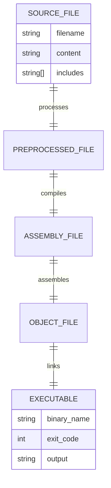
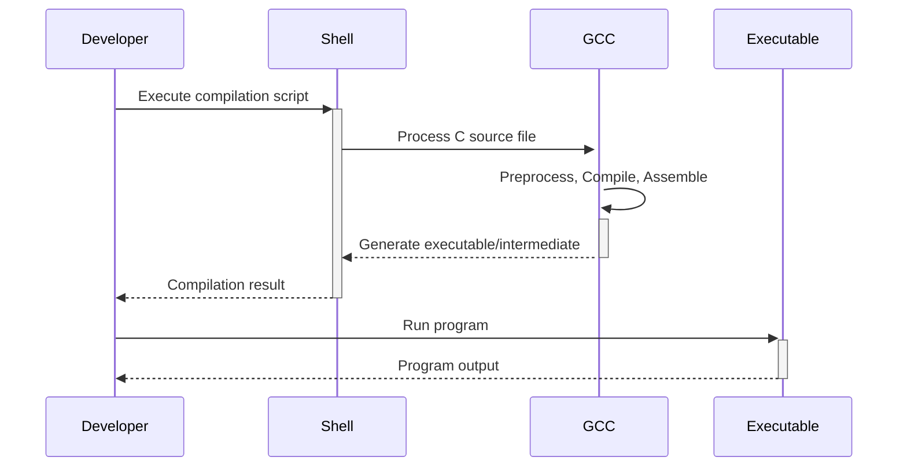

# 🏗️ System Architecture

## 📖 Overview
This container introduces fundamental C programming concepts including compilation process, basic output functions, and program structure. It demonstrates the essential pipeline from source code to executable binary through various compilation stages.

---

## 🏛️ High-Level Architecture

```mermaid
graph TD
    A[Source Code (.c)] --> B[Preprocessor]
    B --> C[Compiler]
    C --> D[Assembler] 
    D --> E[Linker]
    E --> F[Executable Binary]
    
    subgraph "Development Environment"
        G[Editor]
        H[GCC Toolchain]
        I[Shell Scripts]
    end
    
    G --> A
    H --> B
    I --> H
```

The architecture demonstrates the complete C compilation pipeline and introduces basic program output mechanisms using standard library functions.

---

## 🧩 Core Components

### Preprocessor Scripts
- **Purpose**: Execute preprocessing stage of compilation
- **Technology**: Shell scripting, GCC preprocessor
- **Location**: `0-preprocessor`
- **Responsibilities**:
  - Remove comments and expand macros
  - Include header files
  - Process conditional compilation directives
- **Interfaces**: Takes C source files, outputs preprocessed code

### Compilation Tools
- **Purpose**: Transform source code through compilation stages
- **Technology**: GCC compiler toolchain
- **Location**: `1-compiler`, `2-assembler`, `3-name`
- **Responsibilities**:
  - Compile C source to assembly
  - Assemble to object code
  - Link to create executable
- **Interfaces**: Shell commands with file I/O

### Output Programs
- **Purpose**: Demonstrate basic C program structure and output
- **Technology**: C language, standard library functions
- **Location**: `4-puts.c`, `5-printf.c`, `6-size.c`, `101-quote.c`
- **Responsibilities**:
  - Display text output using puts() and printf()
  - Show data type sizes
  - Handle standard output and error streams
- **Interfaces**: Standard C library, system calls

---

## 📊 Data Models & Schema



### Key Data Entities
- **Source Files**: C source code with headers and function definitions
- **Compilation Artifacts**: Intermediate files in compilation pipeline
- **Executables**: Final binary programs with specific output behaviors

### Relationships
- Source → Preprocessed: Macro expansion and header inclusion
- Preprocessed → Assembly: Syntax analysis and code generation
- Assembly → Executable: Machine code generation and linking

---

## 🔄 Data Flow & Interactions



### Request/Response Flow
1. **Source Creation**: Developer writes C source code
2. **Compilation**: Shell scripts invoke GCC toolchain
3. **Processing**: Multiple compilation stages executed
4. **Execution**: Binary programs run and produce output

---

## 🚀 Deployment & Environment

### Development Environment
- **Platform**: Unix/Linux environment
- **Dependencies**: GCC compiler, standard C library
- **Setup**: Executable scripts for compilation stages

### Production Considerations
- **Scalability**: Single-file programs, minimal resource usage
- **Performance**: Basic I/O operations, system call efficiency
- **Monitoring**: Exit codes and output verification

### Configuration Management
- **Environment Variables**: Standard PATH, GCC settings
- **Compilation Flags**: Standard C compilation options
- **Output Control**: stdout/stderr redirection

---

## 🔒 Security Architecture

### Authentication & Authorization
- **Authentication**: File system permissions
- **Authorization**: Execute permissions on scripts and binaries
- **Session Management**: Process isolation

### Data Protection
- **Input Validation**: Basic string handling safety
- **Buffer Safety**: Standard library function usage
- **Data Privacy**: No sensitive data handling

### Security Measures
- **File Permissions**: Proper executable permissions
- **Safe Functions**: Use of puts() over unsafe alternatives

---

## ⚡ Error Handling & Resilience

### Error Management Strategy
- **Error Detection**: Compilation errors, runtime failures
- **Error Reporting**: GCC error messages, exit codes
- **Error Recovery**: Manual correction and recompilation

### Resilience Patterns
- **Compilation Verification**: Check for successful compilation
- **Output Validation**: Verify expected program output

---

## 🎯 Design Decisions & Trade-offs

### Key Architectural Decisions
1. **Shell Script Automation**
   - **Decision**: Use shell scripts for compilation stages
   - **Rationale**: Educational clarity and tool demonstration
   - **Alternatives**: Makefiles or manual commands
   - **Trade-offs**: Simplicity vs. automation complexity

2. **Standard Library Usage**
   - **Decision**: Focus on puts() and printf() functions
   - **Rationale**: Introduce safe output mechanisms
   - **Alternatives**: Direct system calls
   - **Trade-offs**: Portability vs. low-level control

### Known Limitations
- **Single File Programs**: No complex project structure
- **Basic Error Handling**: Minimal error recovery mechanisms

### Future Considerations
- **Advanced Compilation**: Optimization flags and techniques
- **Multi-file Projects**: Header files and linking strategies

---

## 📁 Directory Structure & Organization

```
0x00-hello_world/
├── 0-preprocessor        # Preprocessing stage script
├── 1-compiler           # Compilation stage script  
├── 2-assembler          # Assembly stage script
├── 3-name               # Executable naming script
├── 4-puts.c             # Basic puts() usage
├── 5-printf.c           # Basic printf() usage
├── 6-size.c             # Data type sizes
├── 100-intel            # Intel syntax assembly
├── 101-quote.c          # stderr output example
├── README.md            # Project documentation
├── PROJECT-MANIFEST.md  # Learning objectives
└── .repo-context.json   # Repository metadata
```

### Organization Principles
- **Sequential Learning**: Files numbered by complexity progression
- **Tool Separation**: Individual scripts for each compilation stage
- **Example Progression**: Simple to complex C program examples

---

## 🔗 External Dependencies

| Dependency | Purpose | Version | Documentation |
|------------|---------|---------|---------------|
| GCC | C Compiler | 4.8+ | [GCC Manual](https://gcc.gnu.org/onlinedocs/) |
| GNU Binutils | Assembly tools | Latest | [Binutils Docs](https://sourceware.org/binutils/) |
| Standard C Library | Runtime functions | POSIX | [C Standard](https://en.cppreference.com/) |

---

## 📚 References
- [Project README](README.md)
- [Learning Objectives](PROJECT-MANIFEST.md)
- [C Programming Language Standard](https://www.iso.org/standard/74528.html)
