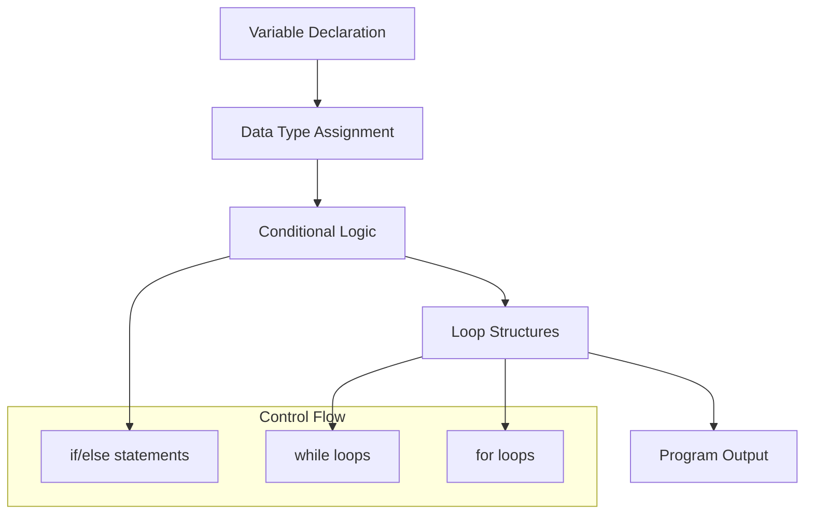
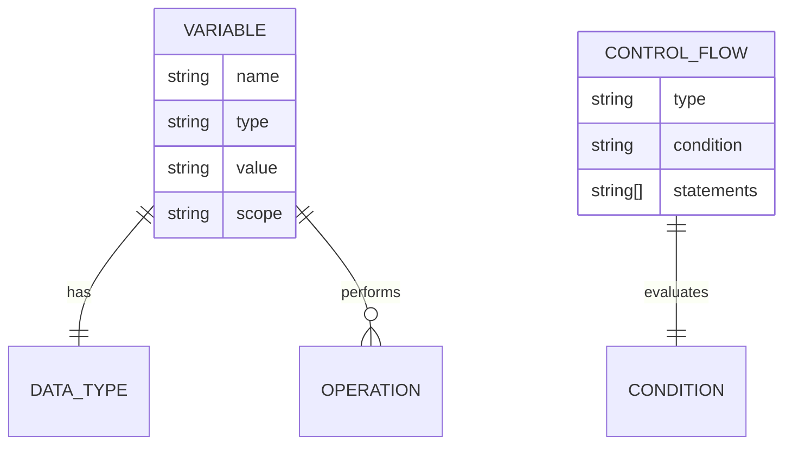
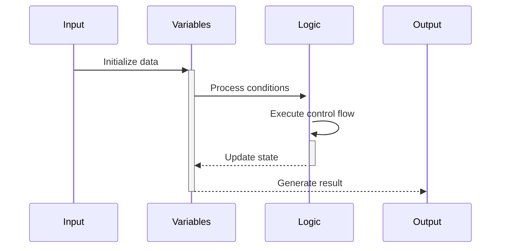

# 🏗️ System Architecture

## 📖 Overview
This container focuses on C variables, conditional statements, and loop constructs. It establishes fundamental programming concepts including data types, control flow, and iterative logic essential for algorithmic thinking.

---

## 🏛️ High-Level Architecture



The architecture demonstrates progressive complexity from basic variable handling to complex control flow structures.

---

## 🧩 Core Components

### Variable Management System
- **Purpose**: Handle different C data types and variable operations
- **Technology**: C language, primitive data types
- **Location**: Various numbered files
- **Responsibilities**:
  - Integer and character variable declarations
  - ASCII value manipulations
  - Variable scope management
- **Interfaces**: Standard C variable declaration syntax

### Conditional Logic Engine
- **Purpose**: Implement decision-making logic in programs
- **Technology**: C conditional statements (if/else)
- **Location**: Conditional-based exercises
- **Responsibilities**:
  - Boolean expression evaluation
  - Branching logic implementation
  - Comparison operations
- **Interfaces**: Standard C conditional syntax

### Loop Control Systems
- **Purpose**: Implement iterative programming constructs
- **Technology**: C loop statements (while, for)
- **Location**: Loop-based exercises
- **Responsibilities**:
  - Iteration control
  - Counter management
  - Break and continue logic
- **Interfaces**: Standard C loop syntax

---

## 📊 Data Models & Schema



### Key Data Entities
- **Variables**: Integer, character, and boolean data containers
- **Control Structures**: Conditional and iterative programming constructs
- **Operations**: Arithmetic, logical, and comparison operations

### Relationships
- Variables → Data Types: Type system enforcement
- Control Flow → Conditions: Boolean evaluation logic

---

## 🔄 Data Flow & Interactions



### Request/Response Flow
1. **Initialization**: Variables are declared and initialized
2. **Processing**: Conditional logic evaluates expressions
3. **Iteration**: Loop structures control program flow
4. **Output**: Results are displayed or stored

---

## 🚀 Deployment & Environment

### Development Environment
- **Platform**: Unix/Linux with GCC compiler
- **Dependencies**: Standard C library, basic I/O functions
- **Setup**: Compilation with standard flags

### Production Considerations
- **Scalability**: Single-threaded, minimal memory usage
- **Performance**: Efficient variable access and control flow
- **Monitoring**: Program exit codes and output verification

---

## 🔒 Security Architecture

### Data Protection
- **Type Safety**: C type system enforcement
- **Memory Safety**: Stack-based variable allocation
- **Input Validation**: Basic bounds checking where applicable

---

## 🎯 Design Decisions & Trade-offs

### Key Architectural Decisions
1. **Progressive Complexity**
   - **Decision**: Build from simple variables to complex control flow
   - **Rationale**: Educational scaffolding approach
   - **Trade-offs**: Simplicity vs. real-world complexity

2. **Standard C Constructs**
   - **Decision**: Use only standard C language features
   - **Rationale**: Foundational learning without advanced features
   - **Trade-offs**: Limited functionality vs. learning clarity

---

## 📁 Directory Structure & Organization

```
0x01-variables_if_else_while/
├── [0-9]-*.c             # Basic exercises
├── [100-102]-*.c         # Advanced exercises
├── README.md             # Project documentation
├── PROJECT-MANIFEST.md   # Learning objectives
└── .repo-context.json    # Repository metadata
```

### Organization Principles
- **Incremental Difficulty**: Files progress from basic to advanced
- **Concept Grouping**: Related concepts in sequential files
- **Clear Naming**: Descriptive filenames indicating content

---

## 🔗 External Dependencies

| Dependency | Purpose | Version | Documentation |
|------------|---------|---------|---------------|
| GCC | C Compiler | 4.8+ | [GCC Manual](https://gcc.gnu.org/onlinedocs/) |
| Standard C Library | Basic I/O functions | POSIX | [C Standard](https://en.cppreference.com/) |

---

## 📚 References
- [Project README](README.md)
- [Learning Objectives](PROJECT-MANIFEST.md)
- [C Control Structures Guide](https://en.cppreference.com/w/c/language/statements)
