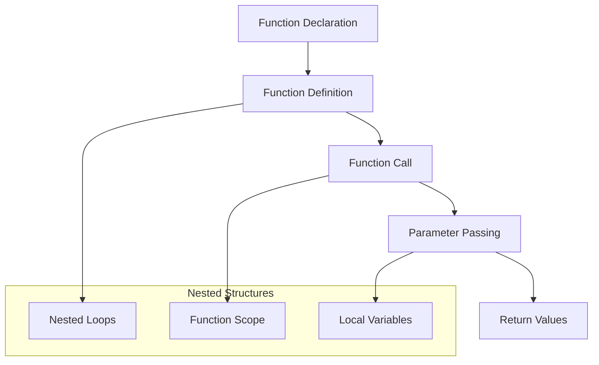
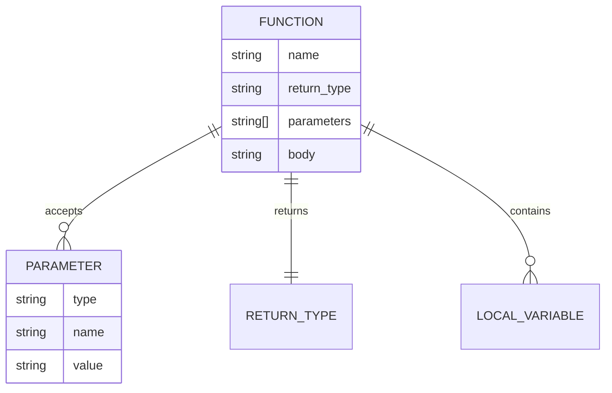
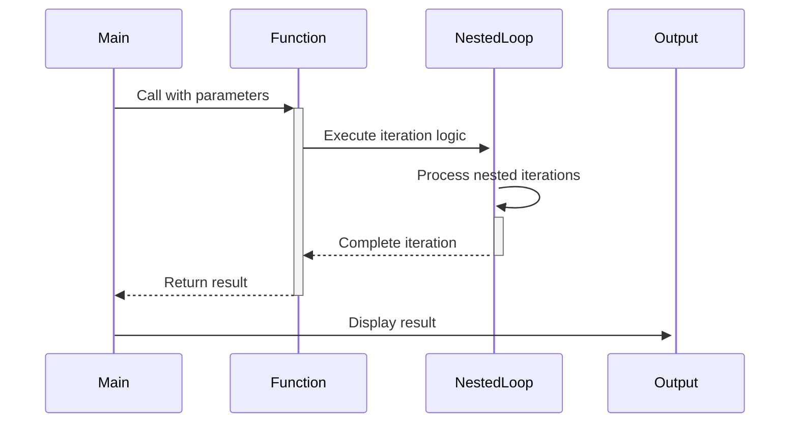

# 🏗️ System Architecture

## 📖 Overview
This container introduces function concepts in C programming, including function declaration, definition, nested loops, and modular programming principles. It establishes the foundation for code reusability and structured programming approaches.

---

## 🏛️ High-Level Architecture



The architecture demonstrates modular programming concepts with emphasis on function-based code organization and nested control structures.

---

## 🧩 Core Components

### Function Management System
- **Purpose**: Implement modular programming with custom functions
- **Technology**: C function declarations and definitions
- **Location**: Function-based exercises
- **Responsibilities**:
  - Function prototyping
  - Parameter handling
  - Return value management
  - Scope control
- **Interfaces**: Standard C function syntax

### Nested Loop Engine
- **Purpose**: Implement complex iterative patterns using nested loops
- **Technology**: Nested for/while loop constructs
- **Location**: Pattern-generating exercises
- **Responsibilities**:
  - Multi-dimensional iteration
  - Pattern generation logic
  - Complex counting mechanisms
- **Interfaces**: Standard C loop nesting

### Utility Function Library
- **Purpose**: Provide reusable utility functions
- **Technology**: Custom C functions with specific purposes
- **Location**: Individual utility files
- **Responsibilities**:
  - Mathematical operations
  - Character manipulations
  - Input/output helpers
- **Interfaces**: Function call mechanisms

---

## 📊 Data Models & Schema



### Key Data Entities
- **Functions**: Named code blocks with specific purposes
- **Parameters**: Input data passed to functions
- **Local Variables**: Function-scoped data storage

### Relationships
- Functions → Parameters: Input data flow
- Functions → Return Types: Output data specification
- Functions → Local Variables: Scope-based data management

---

## 🔄 Data Flow & Interactions



### Request/Response Flow
1. **Function Call**: Main program invokes custom functions
2. **Parameter Passing**: Data transmitted to function scope
3. **Processing**: Function executes nested logic
4. **Return**: Results passed back to calling context

---

## 🚀 Deployment & Environment

### Development Environment
- **Platform**: Unix/Linux environment with GCC
- **Dependencies**: Standard C library, math library
- **Setup**: Compilation with function linking

### Production Considerations
- **Scalability**: Modular function-based architecture
- **Performance**: Function call overhead considerations
- **Monitoring**: Function return codes and output validation

---

## 🔒 Security Architecture

### Data Protection
- **Parameter Validation**: Function input checking
- **Scope Isolation**: Local variable protection
- **Stack Safety**: Proper function call management

---

## 🎯 Design Decisions & Trade-offs

### Key Architectural Decisions
1. **Modular Approach**
   - **Decision**: Separate functionality into discrete functions
   - **Rationale**: Code reusability and maintainability
   - **Trade-offs**: Function call overhead vs. code organization

2. **Nested Loop Patterns**
   - **Decision**: Use nested loops for complex patterns
   - **Rationale**: Educational demonstration of iteration complexity
   - **Trade-offs**: Performance vs. pattern complexity

---

## 📁 Directory Structure & Organization

```
0x02-functions_nested_loops/
├── main.h                # Function prototypes header
├── _putchar.c           # Character output utility
├── [0-9]-*.c            # Basic function exercises
├── [10-11]-*.c          # Advanced exercises
├── README.md            # Project documentation
├── PROJECT-MANIFEST.md  # Learning objectives
└── .repo-context.json   # Repository metadata
```

### Organization Principles
- **Header Separation**: Function prototypes in dedicated header
- **Utility Functions**: Reusable functions in separate files
- **Progressive Complexity**: Simple to advanced function usage

---

## 🔗 External Dependencies

| Dependency | Purpose | Version | Documentation |
|------------|---------|---------|---------------|
| GCC | C Compiler | 4.8+ | [GCC Manual](https://gcc.gnu.org/onlinedocs/) |
| Standard C Library | I/O and utility functions | POSIX | [C Standard](https://en.cppreference.com/) |

---

## 📚 References
- [Project README](README.md)
- [Learning Objectives](PROJECT-MANIFEST.md)
- [C Functions Guide](https://en.cppreference.com/w/c/language/functions)
