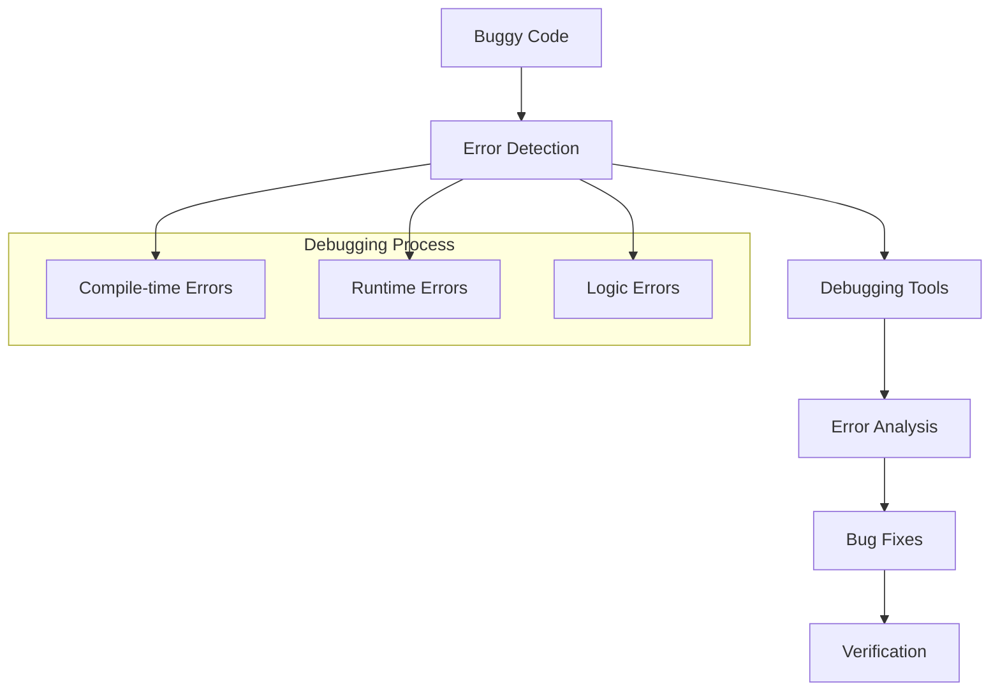
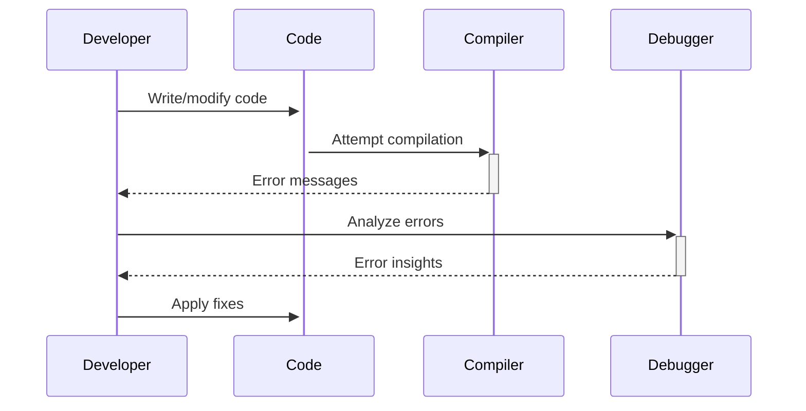

# 🏗️ System Architecture

## 📖 Overview
This container focuses on debugging techniques and error identification in C programs. It introduces systematic approaches to finding and fixing bugs, understanding error messages, and developing debugging skills essential for software development.

---

## 🏛️ High-Level Architecture



The architecture demonstrates systematic debugging workflows and error resolution methodologies for C programming.

---

## 🧩 Core Components

### Error Detection System
- **Purpose**: Identify different types of programming errors
- **Technology**: GCC compiler warnings/errors, debugging output
- **Location**: Buggy source files and corrected versions
- **Responsibilities**:
  - Syntax error identification
  - Logic error detection
  - Runtime error analysis
- **Interfaces**: Compiler output, program execution results

### Debugging Methodology
- **Purpose**: Systematic approach to bug identification and resolution
- **Technology**: Debugging tools, careful code analysis
- **Location**: Debugging exercises and corrected implementations
- **Responsibilities**:
  - Step-by-step error analysis
  - Root cause identification
  - Solution implementation
- **Interfaces**: Developer workflow and debugging tools

### Verification Framework
- **Purpose**: Ensure bug fixes are correct and complete
- **Technology**: Test cases, output comparison
- **Location**: Test files and validation scripts
- **Responsibilities**:
  - Fix verification
  - Regression testing
  - Quality assurance
- **Interfaces**: Testing protocols and validation methods

---

## 🔄 Data Flow & Interactions



### Request/Response Flow
1. **Error Discovery**: Bugs identified through compilation or testing
2. **Analysis**: Systematic examination of error patterns
3. **Resolution**: Implementation of targeted fixes
4. **Verification**: Confirmation that bugs are resolved

---

## 📁 Directory Structure & Organization

```
0x03-debugging/
├── [0-3]-*.c           # Debugging exercises
├── main.h              # Header file with prototypes
├── README.md           # Project documentation  
├── PROJECT-MANIFEST.md # Learning objectives
└── .repo-context.json  # Repository metadata
```

---

## 📚 References
- [Project README](README.md)
- [Learning Objectives](PROJECT-MANIFEST.md)
- [GDB Debugging Guide](https://www.gnu.org/software/gdb/documentation/)
