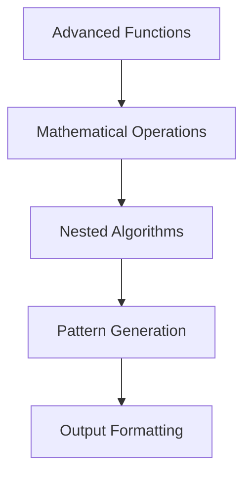

# 🏗️ System Architecture

## 📖 Overview
This container extends function and nested loop concepts with advanced function patterns, mathematical operations, and complex algorithmic implementations using nested iteration structures.

---

## 🏛️ High-Level Architecture



The architecture demonstrates advanced function design with complex nested loop patterns for mathematical and algorithmic operations.

---

## 🧩 Core Components

### Mathematical Function Library
- **Purpose**: Implement mathematical operations and calculations
- **Technology**: C mathematical functions and algorithms
- **Responsibilities**: Prime checking, digit operations, mathematical computations

### Pattern Generation Engine
- **Purpose**: Create complex patterns using nested loops
- **Technology**: Multi-level loop nesting and conditional logic
- **Responsibilities**: Number patterns, shape generation, sequence creation

### Algorithm Implementation System
- **Purpose**: Advanced algorithmic problem solving
- **Technology**: Optimized C implementations with nested structures
- **Responsibilities**: Efficient algorithm design, performance optimization

---

## 📁 Directory Structure & Organization

```
0x04-more_functions_nested_loops/
├── main.h                    # Function prototypes
├── _putchar.c               # Character output utility
├── [0-10]-*.c               # Progressive exercises
├── [100-101]-*.c            # Advanced challenges
├── README.md                # Project documentation
└── .repo-context.json       # Repository metadata
```

---

## 📚 References
- [Project README](README.md)
- [Learning Objectives](PROJECT-MANIFEST.md)
