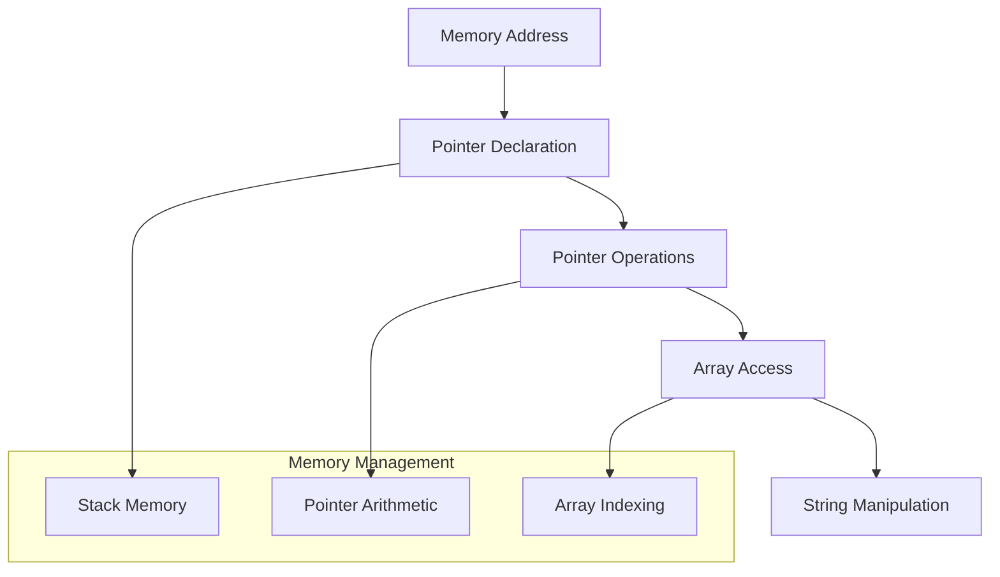
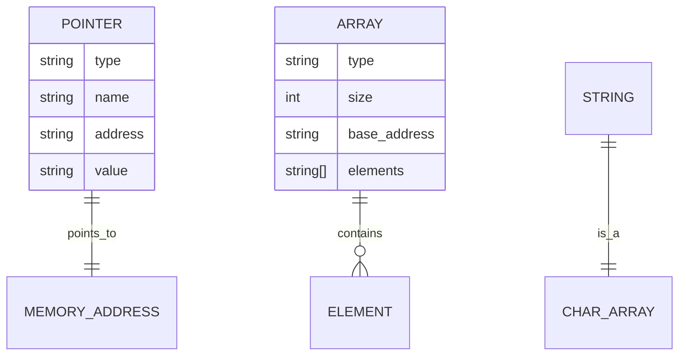
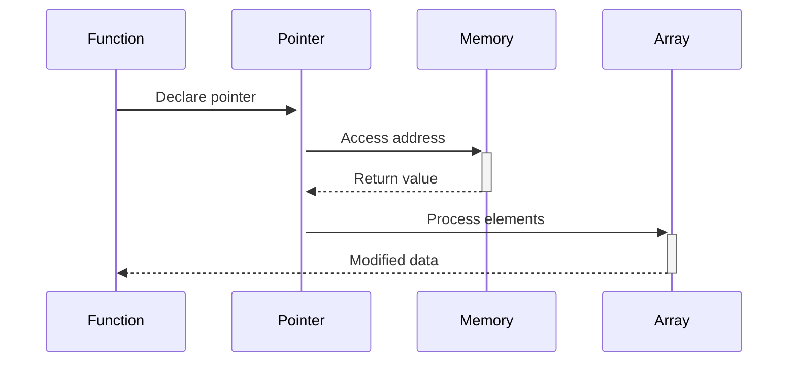

# 🏗️ System Architecture

## 📖 Overview
This container introduces pointer concepts, array manipulation, and string operations in C programming. It establishes fundamental understanding of memory addressing, pointer arithmetic, and the relationship between arrays and pointers.

---

## 🏛️ High-Level Architecture



The architecture demonstrates memory address management and the fundamental relationship between pointers, arrays, and strings in C.

---

## 🧩 Core Components

### Pointer Management System
- **Purpose**: Handle memory addresses and pointer operations
- **Technology**: C pointer syntax and operations
- **Location**: Pointer-based exercises
- **Responsibilities**:
  - Pointer declaration and initialization
  - Dereferencing operations
  - Address arithmetic
  - Null pointer handling
- **Interfaces**: Standard C pointer syntax

### Array Processing Engine
- **Purpose**: Manipulate arrays using pointer techniques
- **Technology**: Array/pointer duality in C
- **Location**: Array manipulation functions
- **Responsibilities**:
  - Array traversal using pointers
  - Element access and modification
  - Array bounds management
  - Multi-dimensional array handling
- **Interfaces**: Pointer-based array operations

### String Operations Library
- **Purpose**: Implement string manipulation using pointers
- **Technology**: Character arrays and pointer arithmetic
- **Location**: String function implementations
- **Responsibilities**:
  - String length calculation
  - String copying and concatenation
  - Character searching and replacement
  - String comparison operations
- **Interfaces**: String function signatures with pointer parameters

---

## 📊 Data Models & Schema



### Key Data Entities
- **Pointers**: Variables storing memory addresses
- **Arrays**: Contiguous memory blocks for multiple values
- **Strings**: Null-terminated character arrays

### Relationships
- Pointers → Memory Addresses: Direct memory access
- Arrays → Elements: Indexed data storage
- Strings → Character Arrays: Text representation

---

## 🔄 Data Flow & Interactions



### Request/Response Flow
1. **Pointer Declaration**: Memory address variables created
2. **Address Assignment**: Pointers linked to memory locations
3. **Dereferencing**: Values accessed through pointers
4. **Array Processing**: Elements manipulated via pointer arithmetic

---

## 📁 Directory Structure & Organization

```
0x05-pointers_arrays_strings/
├── main.h                    # Function prototypes
├── _putchar.c               # Character output utility
├── 0-reset_to_98.c          # Pointer basics
├── 1-swap.c                 # Value swapping
├── 2-strlen.c               # String length
├── 3-puts.c                 # String output
├── 4-print_rev.c            # Reverse string print
├── 5-rev_string.c           # String reversal
├── 6-puts2.c                # Every other character
├── 7-puts_half.c            # Half string print
├── 8-print_array.c          # Array printing
├── 9-strcpy.c               # String copying
├── [100-102]-*.c            # Advanced exercises
├── README.md                # Project documentation
├── PROJECT-MANIFEST.md      # Learning objectives
└── .repo-context.json       # Repository metadata
```

### Organization Principles
- **Concept Progression**: Basic pointers to complex string operations
- **Practical Examples**: Real-world string and array manipulation
- **Utility Functions**: Reusable pointer-based implementations

---

## 📚 References
- [Project README](README.md)
- [Learning Objectives](PROJECT-MANIFEST.md)
- [C Pointers Guide](https://en.cppreference.com/w/c/language/pointer)
