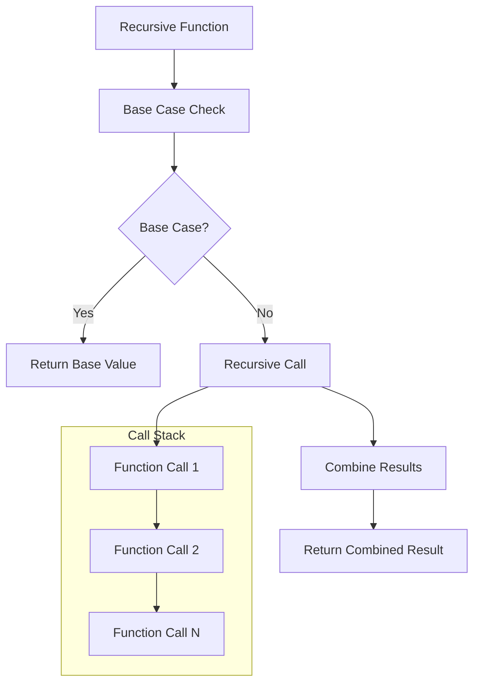
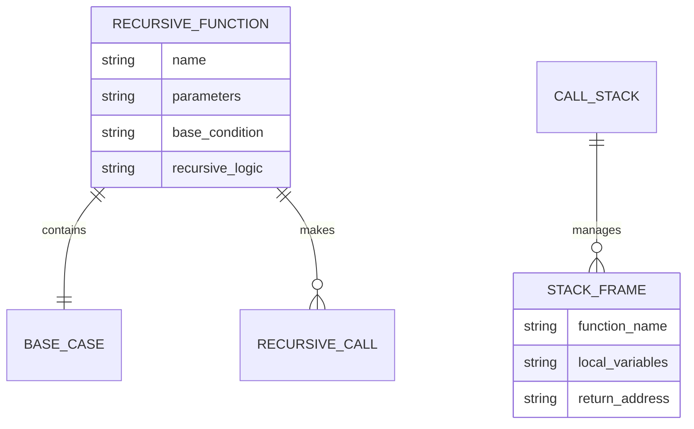
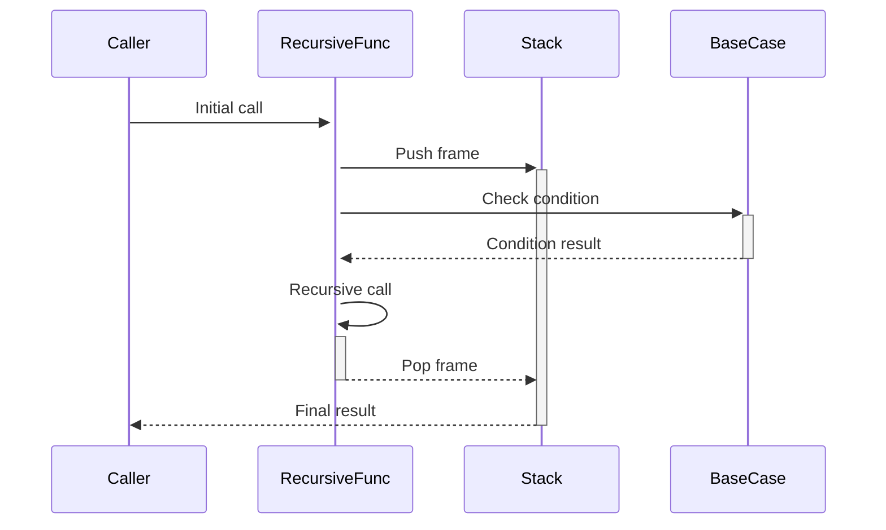

# 🏗️ System Architecture

## 📖 Overview
This container introduces recursive programming concepts, demonstrating how functions can call themselves to solve complex problems. It covers recursive thinking, base cases, and recursive implementations of fundamental algorithms.

---

## 🏛️ High-Level Architecture



The architecture demonstrates recursive function design patterns with proper base case handling and call stack management.

---

## 🧩 Core Components

### Recursive Engine
- **Purpose**: Implement self-calling function mechanisms
- **Technology**: C function recursion with stack management
- **Location**: Recursive function implementations
- **Responsibilities**:
  - Base case evaluation
  - Recursive call execution
  - Result combination logic
  - Stack frame management
- **Interfaces**: Function call/return mechanism

### Base Case Handler
- **Purpose**: Provide termination conditions for recursion
- **Technology**: Conditional logic and return statements
- **Location**: Within recursive functions
- **Responsibilities**:
  - Recursion termination
  - Edge case handling
  - Boundary condition management
- **Interfaces**: Conditional evaluation system

### Algorithm Library
- **Purpose**: Collection of recursive algorithm implementations
- **Technology**: Mathematical and string processing functions
- **Location**: Individual algorithm files
- **Responsibilities**:
  - Mathematical computations (factorial, power)
  - String operations (length, palindrome check)
  - Search algorithms (prime checking)
- **Interfaces**: Standard C function signatures

---

## 📊 Data Models & Schema



### Key Data Entities
- **Recursive Functions**: Self-calling algorithmic implementations
- **Call Stack**: Runtime stack frame management
- **Base Cases**: Termination conditions for recursive processes

### Relationships
- Functions → Base Cases: Termination condition dependency
- Functions → Call Stack: Runtime execution management

---

## 🔄 Data Flow & Interactions



### Request/Response Flow
1. **Initial Call**: Function invoked with input parameters
2. **Base Case Check**: Termination condition evaluated
3. **Recursive Descent**: Function calls itself with modified parameters
4. **Stack Unwinding**: Results combined as calls return

---

## 🚀 Deployment & Environment

### Development Environment
- **Platform**: Unix/Linux with GCC compiler
- **Dependencies**: Standard C library, math functions
- **Setup**: Compilation with stack size considerations

### Production Considerations
- **Scalability**: Stack depth limitations for deep recursion
- **Performance**: Function call overhead and memory usage
- **Monitoring**: Stack overflow protection and depth tracking

---

## 🔒 Security Architecture

### Data Protection
- **Stack Safety**: Protection against stack overflow
- **Parameter Validation**: Input bounds checking
- **Recursion Depth**: Maximum depth limitations

---

## 🎯 Design Decisions & Trade-offs

### Key Architectural Decisions
1. **Recursive vs Iterative**
   - **Decision**: Use recursion for naturally recursive problems
   - **Rationale**: Educational demonstration of recursive thinking
   - **Trade-offs**: Stack usage vs. code clarity

2. **Base Case Design**
   - **Decision**: Simple, clear termination conditions
   - **Rationale**: Prevent infinite recursion
   - **Trade-offs**: Safety vs. complexity

---

## 📁 Directory Structure & Organization

```
0x08-recursion/
├── main.h                    # Function prototypes
├── _putchar.c               # Character output utility
├── 0-puts_recursion.c       # Basic recursive output
├── 1-print_rev_recursion.c  # Reverse string recursion
├── 2-strlen_recursion.c     # String length recursion
├── 3-factorial.c            # Factorial calculation
├── 4-pow_recursion.c        # Power calculation
├── 5-sqrt_recursion.c       # Square root calculation
├── 6-is_prime_number.c      # Prime number checking
├── 100-is_palindrome.c      # Palindrome verification
├── 101-wildcmp.c            # Wildcard comparison
├── README.md                # Project documentation
├── PROJECT-MANIFEST.md      # Learning objectives
└── .repo-context.json       # Repository metadata
```

### Organization Principles
- **Complexity Progression**: Simple to advanced recursive concepts
- **Algorithm Categories**: String, mathematical, and comparison operations
- **Clear Naming**: Function purpose evident from filename

---

## 🔗 External Dependencies

| Dependency | Purpose | Version | Documentation |
|------------|---------|---------|---------------|
| GCC | C Compiler | 4.8+ | [GCC Manual](https://gcc.gnu.org/onlinedocs/) |
| Standard C Library | Basic functions | POSIX | [C Standard](https://en.cppreference.com/) |

---

## 📚 References
- [Project README](README.md)
- [Learning Objectives](PROJECT-MANIFEST.md)
- [Recursion in C](https://en.wikipedia.org/wiki/Recursion_(computer_science))
