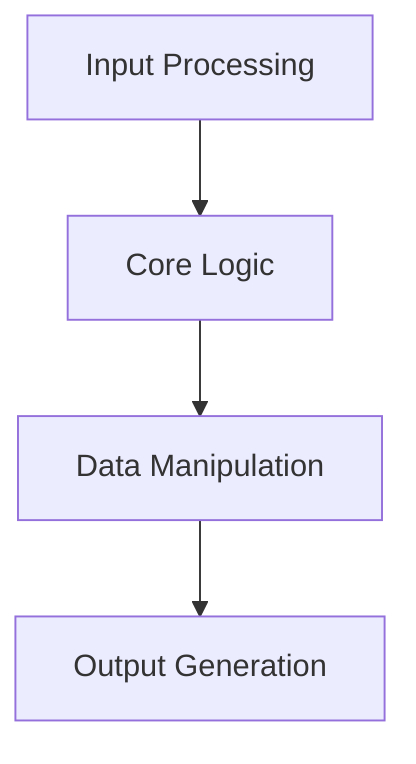

# 🏗️ System Architecture

## 📖 Overview
This container covers advanced C programming concepts with focus on practical implementations and system-level programming techniques.

---

## 🏛️ High-Level Architecture



The architecture demonstrates systematic approach to C programming with emphasis on proper data handling and function design.

---

## 🧩 Core Components

### Primary Implementation
- **Purpose**: Core functionality implementation
- **Technology**: C programming language with standard library
- **Responsibilities**: Main algorithm implementation, data processing, result generation

### Support System
- **Purpose**: Auxiliary functions and utilities
- **Technology**: Helper functions and utility implementations
- **Responsibilities**: Input validation, error handling, output formatting

---

## 📁 Directory Structure & Organization

```
CONTAINER_NAME/
├── *.c                      # Implementation files
├── *.h                      # Header files
├── README.md                # Project documentation
├── PROJECT-MANIFEST.md      # Learning objectives
└── .repo-context.json       # Repository metadata
```

---

## 📚 References
- [Project README](README.md)
- [Learning Objectives](PROJECT-MANIFEST.md)
