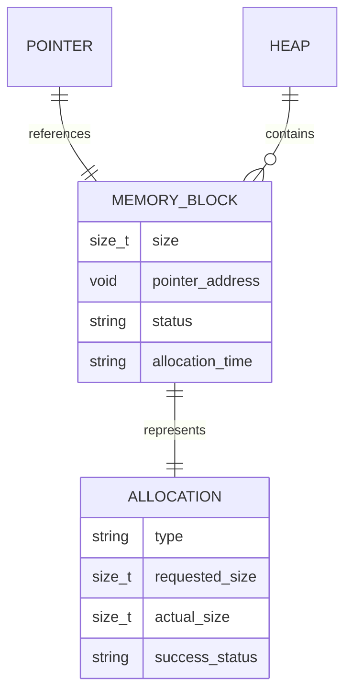
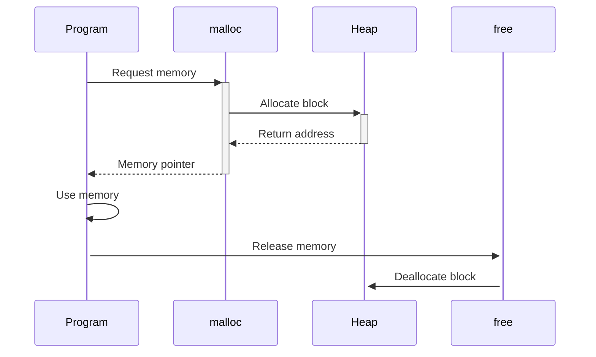

# 🏗️ System Architecture

## 📖 Overview
This container focuses on dynamic memory allocation using malloc and free functions. It introduces heap memory management, memory allocation strategies, and the critical concepts of memory leaks and proper memory cleanup.

---

## 🏛️ High-Level Architecture

```mermaid
graph TD
    A[Memory Request] --> B[malloc()]
    B --> C[Heap Allocation]
    C --> D[Memory Usage]
    D --> E[free()]
    E --> F[Memory Deallocation]
    
    subgraph "Memory Management"
        G[Heap Memory]
        H[Memory Blocks]
        I[Memory Pool]
    end
    
    B --> G
    C --> H
    F --> I
```

The architecture demonstrates dynamic memory management lifecycle from allocation to deallocation with proper cleanup procedures.

---

## 🧩 Core Components

### Dynamic Memory Allocator
- **Purpose**: Manage heap memory allocation and deallocation
- **Technology**: malloc(), free(), calloc() system functions
- **Location**: Memory allocation exercises
- **Responsibilities**:
  - Memory allocation requests
  - Heap space management
  - Memory block tracking
  - Allocation failure handling
- **Interfaces**: Standard C memory management functions

### Memory Safety Manager
- **Purpose**: Ensure proper memory usage and cleanup
- **Technology**: Pointer validation and memory tracking
- **Location**: Memory management functions
- **Responsibilities**:
  - Memory leak prevention
  - Double-free protection
  - Null pointer checking
  - Memory bounds validation
- **Interfaces**: Safe memory operation wrappers

### Data Structure Allocator
- **Purpose**: Allocate memory for complex data structures
- **Technology**: Dynamic array and structure allocation
- **Location**: Structure allocation exercises
- **Responsibilities**:
  - Array memory allocation
  - Structure instance creation
  - Multi-dimensional array handling
  - Dynamic size management
- **Interfaces**: Type-specific allocation functions

---

## 📊 Data Models & Schema



### Key Data Entities
- **Memory Blocks**: Allocated heap memory segments
- **Pointers**: References to allocated memory
- **Heap**: Dynamic memory pool managed by system

### Relationships
- Pointers → Memory Blocks: Direct memory access
- Heap → Memory Blocks: Memory pool management
- Memory Blocks → Allocations: Allocation tracking

---

## 🔄 Data Flow & Interactions



### Request/Response Flow
1. **Memory Request**: Program requests dynamic memory allocation
2. **Allocation**: System allocates memory from heap
3. **Usage**: Program uses allocated memory for data storage
4. **Cleanup**: Memory explicitly freed to prevent leaks

---

## 📁 Directory Structure & Organization

```
0x0B-malloc_free/
├── main.h                    # Function prototypes
├── 0-create_array.c         # Array creation
├── 1-strdup.c               # String duplication
├── 2-str_concat.c           # String concatenation
├── 3-alloc_grid.c           # 2D array allocation
├── 4-free_grid.c            # 2D array deallocation
├── [100-101]-*.c            # Advanced exercises
├── README.md                # Project documentation
├── PROJECT-MANIFEST.md      # Learning objectives
└── .repo-context.json       # Repository metadata
```

---

## 📚 References
- [Project README](README.md)
- [Learning Objectives](PROJECT-MANIFEST.md)
- [Dynamic Memory Management](https://en.cppreference.com/w/c/memory)
