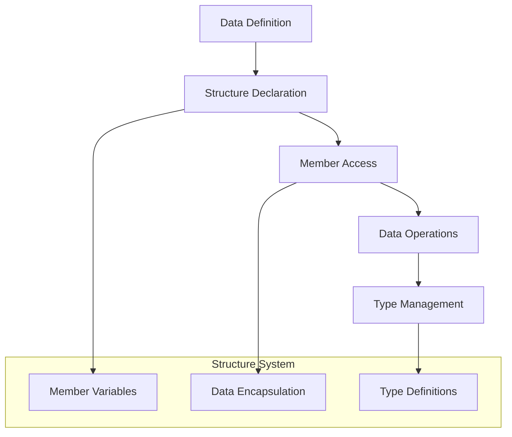

# 🏗️ System Architecture

## 📖 Overview
This container introduces C structures and typedef concepts, demonstrating how to create custom data types, organize related data, and implement object-oriented programming concepts in C through structured data management.

---

## 🏛️ High-Level Architecture



The architecture demonstrates structured data management and custom type creation for organized programming approaches.

---

## 🧩 Core Components

### Structure Definition System
- **Purpose**: Define custom data types with multiple members
- **Technology**: C struct keyword and member definitions
- **Location**: Structure definition exercises
- **Responsibilities**:
  - Data member organization
  - Structure layout management
  - Member type specification
  - Structure size calculation
- **Interfaces**: Structure declaration syntax

### Member Access Manager
- **Purpose**: Provide access to structure members
- **Technology**: Dot notation and pointer member access
- **Location**: Structure manipulation functions
- **Responsibilities**:
  - Direct member access
  - Pointer-based member access
  - Member value assignment
  - Structure copying operations
- **Interfaces**: Member access operators

### Type Definition Engine
- **Purpose**: Create aliases for complex types using typedef
- **Technology**: typedef keyword and type aliasing
- **Location**: Type definition declarations
- **Responsibilities**:
  - Type name simplification
  - Custom type creation
  - Type abstraction management
  - Code readability enhancement
- **Interfaces**: Type definition syntax

---

## 📁 Directory Structure & Organization

```
0x0E-structures_typedef/
├── dog.h                     # Structure definitions
├── 1-init_dog.c             # Structure initialization
├── 2-print_dog.c            # Structure display
├── 4-new_dog.c              # Dynamic structure creation
├── 5-free_dog.c             # Structure memory cleanup
├── README.md                # Project documentation
├── PROJECT-MANIFEST.md      # Learning objectives
└── .repo-context.json       # Repository metadata
```

---

## 📚 References
- [Project README](README.md)
- [Learning Objectives](PROJECT-MANIFEST.md)
- [C Structures](https://en.cppreference.com/w/c/language/struct)
