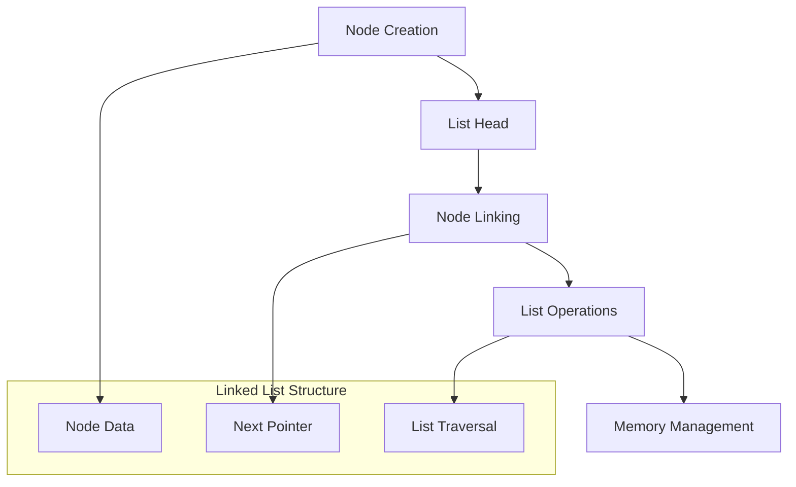
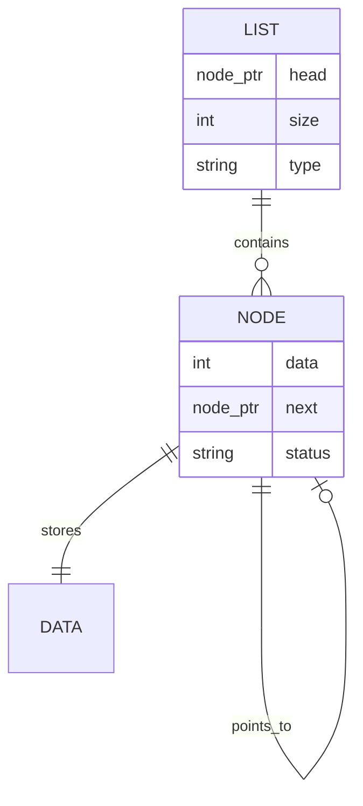

# 🏗️ System Architecture

## 📖 Overview
This container introduces singly linked lists data structure implementation in C. It demonstrates dynamic data structures, node-based memory management, and fundamental operations for creating, manipulating, and traversing linked lists.

---

## 🏛️ High-Level Architecture



The architecture demonstrates dynamic list management with pointer-based node connections and comprehensive list operation implementations.

---

## 🧩 Core Components

### Node Management System
- **Purpose**: Create and manage individual list nodes
- **Technology**: Dynamic memory allocation for node structures
- **Location**: Node creation and manipulation functions
- **Responsibilities**:
  - Node memory allocation
  - Data assignment to nodes
  - Pointer link management
  - Node destruction and cleanup
- **Interfaces**: Node structure and creation functions

### List Operations Engine
- **Purpose**: Implement fundamental linked list operations
- **Technology**: Pointer manipulation and traversal algorithms
- **Location**: List operation function implementations
- **Responsibilities**:
  - List traversal and printing
  - Element insertion and deletion
  - List length calculation
  - List searching and sorting
- **Interfaces**: Standard list operation function signatures

### Memory Management Controller
- **Purpose**: Handle dynamic memory for list structures
- **Technology**: malloc/free operations for node lifecycle
- **Location**: Memory allocation and deallocation functions
- **Responsibilities**:
  - Node memory allocation
  - List memory cleanup
  - Memory leak prevention
  - Proper deallocation ordering
- **Interfaces**: Memory management function wrappers

---

## 📊 Data Models & Schema



### Key Data Entities
- **List**: Container structure with head pointer and metadata
- **Node**: Individual list elements with data and next pointer
- **Data**: Actual information stored in each node

### Relationships
- List → Nodes: Head pointer to first node
- Node → Node: Sequential linking via next pointers
- Node → Data: Each node contains data payload

---

## 📁 Directory Structure & Organization

```
0x12-singly_linked_lists/
├── lists.h                   # Structure definitions and prototypes
├── 0-print_list.c           # List printing function
├── 1-list_len.c             # List length calculation
├── 2-add_node.c             # Add node at beginning
├── 3-add_node_end.c         # Add node at end
├── 4-free_list.c            # Free entire list
├── [100-103]-*.c            # Advanced exercises
├── README.md                # Project documentation
├── PROJECT-MANIFEST.md      # Learning objectives
└── .repo-context.json       # Repository metadata
```

---

## 📚 References
- [Project README](README.md)
- [Learning Objectives](PROJECT-MANIFEST.md)
- [Linked Lists in C](https://en.wikipedia.org/wiki/Linked_list)
