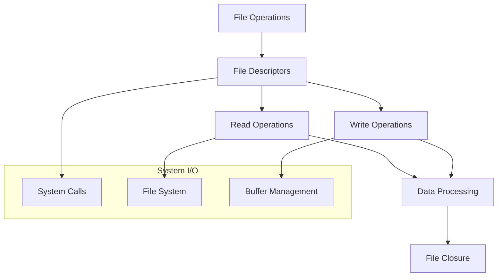

# 🏗️ System Architecture

## 📖 Overview
This container focuses on file input/output operations in C programming. It demonstrates file handling, reading from and writing to files, file descriptors, and system-level I/O operations for persistent data storage and retrieval.

---

## 🏛️ High-Level Architecture



The architecture demonstrates system-level file operations with proper resource management and data persistence mechanisms.

---

## 🧩 Core Components

### File Descriptor Manager
- **Purpose**: Handle file opening, closing, and descriptor management
- **Technology**: System calls (open, close) and file descriptor integers
- **Location**: File operation wrapper functions
- **Responsibilities**:
  - File opening with appropriate modes
  - File descriptor tracking
  - Error handling for file operations
  - Proper file closure and cleanup
- **Interfaces**: System call wrappers with error checking

### Read Operations Engine
- **Purpose**: Implement file reading functionality
- **Technology**: read() system call and buffer management
- **Location**: File reading functions
- **Responsibilities**:
  - Binary and text file reading
  - Buffer allocation and management
  - EOF handling and detection
  - Read error recovery
- **Interfaces**: Read function implementations with buffer handling

### Write Operations Controller
- **Purpose**: Implement file writing functionality
- **Technology**: write() system call and data formatting
- **Location**: File writing functions
- **Responsibilities**:
  - Text and binary data writing
  - Data formatting and conversion
  - Write error handling
  - Data flush and synchronization
- **Interfaces**: Write function implementations with error checking

---

## 📁 Directory Structure & Organization

```
0x15-file_io/
├── main.h                    # Function prototypes
├── 0-read_textfile.c        # Text file reading
├── 1-create_file.c          # File creation
├── 2-append_text_to_file.c  # File appending
├── 3-cp.c                   # File copying utility
├── [100-103]-*.c            # Advanced exercises
├── README.md                # Project documentation
├── PROJECT-MANIFEST.md      # Learning objectives
└── .repo-context.json       # Repository metadata
```

---

## 📚 References
- [Project README](README.md)
- [Learning Objectives](PROJECT-MANIFEST.md)
- [File I/O in C](https://en.cppreference.com/w/c/io)
