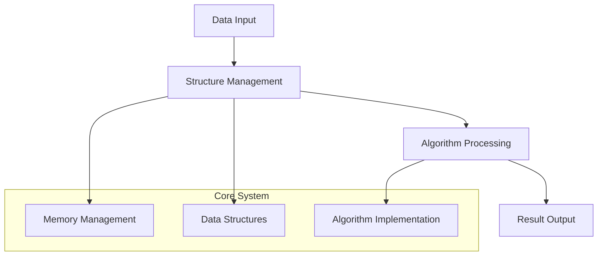

# 🏗️ System Architecture

## 📖 Overview
This container implements advanced C programming concepts and data structures with focus on algorithmic efficiency and system-level programming.

---

## 🏛️ High-Level Architecture



The architecture demonstrates advanced programming techniques with emphasis on data structure implementation and algorithmic problem solving.

---

## 🧩 Core Components

### Data Structure Engine
- **Purpose**: Implement and manage complex data structures
- **Technology**: C programming with dynamic memory allocation
- **Responsibilities**: Structure creation, manipulation, and optimization

### Algorithm Implementation
- **Purpose**: Core algorithmic processing and optimization
- **Technology**: Efficient C implementations with performance focus
- **Responsibilities**: Algorithm design, complexity optimization, result generation

### Memory Management System
- **Purpose**: Handle dynamic memory allocation and cleanup
- **Technology**: malloc/free operations with safety checks
- **Responsibilities**: Memory allocation, leak prevention, resource cleanup

---

## 📁 Directory Structure & Organization

```
CONTAINER_NAME/
├── *.h                      # Header files with definitions
├── *.c                      # Implementation files
├── test files               # Testing and validation
├── README.md                # Project documentation
├── PROJECT-MANIFEST.md      # Learning objectives
└── .repo-context.json       # Repository metadata
```

---

## �� References
- [Project README](README.md)
- [Learning Objectives](PROJECT-MANIFEST.md)
