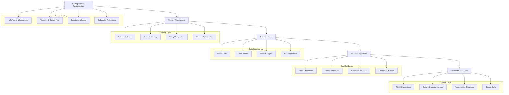
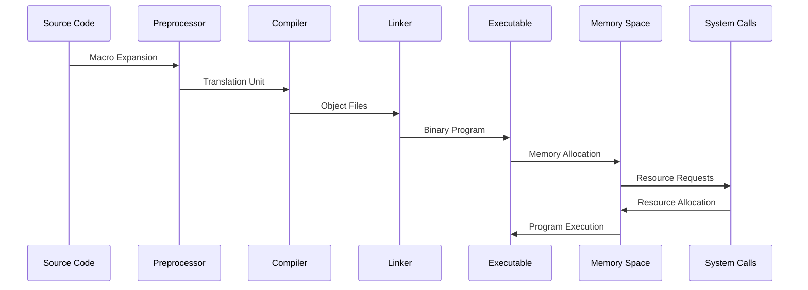
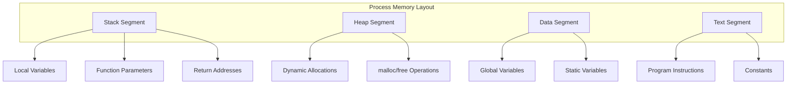
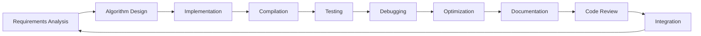

# 🏗️ System Architecture

## 📖 Overview
This repository implements a comprehensive low-level programming education architecture using C language fundamentals. The architecture demonstrates progressive skill development from basic programming concepts to advanced system-level programming, including memory management, data structures, algorithms, and system optimization techniques.

---

## 🏛️ High-Level Architecture



The architecture follows a layered approach where each layer builds foundational knowledge for the next level of complexity.

---

## 🧩 Core Components

### C Programming Fundamentals
- **Purpose**: Establish core programming concepts and C language syntax
- **Technology**: C compiler (gcc), basic UNIX tools
- **Location**: `0x00-hello_world/`, `0x01-variables_if_else_while/`, `0x02-functions_nested_loops/`, `0x03-debugging/`
- **Responsibilities**:
  - Compilation process understanding
  - Variable declaration and manipulation
  - Control flow implementation
  - Function design and implementation
  - Debugging methodology

### Memory Management Layer
- **Purpose**: Direct memory manipulation and optimization
- **Technology**: C pointers, dynamic allocation functions
- **Location**: `0x05-pointers_arrays_strings/`, `0x06-pointers_arrays_strings/`, `0x07-pointers_arrays_strings/`, `0x0B-malloc_free/`, `0x0C-more_malloc_free/`
- **Responsibilities**:
  - Pointer arithmetic and manipulation
  - Array and string operations
  - Dynamic memory allocation and deallocation
  - Memory leak prevention
  - Buffer management

### Data Structure Implementation
- **Purpose**: Implement fundamental computer science data structures
- **Technology**: C structures, dynamic memory, algorithm design
- **Location**: `0x12-singly_linked_lists/`, `0x13-more_singly_linked_lists/`, `0x17-doubly_linked_lists/`, `0x1A-hash_tables/`, `0x0E-structures_typedef/`
- **Responsibilities**:
  - Linked list operations (insertion, deletion, traversal)
  - Hash table implementation and collision handling
  - Custom data type definition
  - Structure memory layout optimization
  - Iterator pattern implementation

### Algorithm Design Layer
- **Purpose**: Implement and optimize fundamental algorithms
- **Technology**: C language, mathematical analysis, complexity theory
- **Location**: `0x1E-search_algorithms/`, `0x08-recursion/`, `0x14-bit_manipulation/`
- **Responsibilities**:
  - Search algorithm implementation (linear, binary, interpolation)
  - Recursive problem solving
  - Bit-level operations and optimizations
  - Algorithm complexity analysis
  - Performance optimization techniques

### System Programming Layer
- **Purpose**: Interface with operating system and hardware
- **Technology**: System calls, file operations, library creation
- **Location**: `0x15-file_io/`, `0x09-static_libraries/`, `0x18-dynamic_libraries/`, `0x0D-preprocessor/`, `0x1C-makefiles/`
- **Responsibilities**:
  - File system operations
  - Library creation and management
  - Preprocessor directive usage
  - Build system automation
  - System resource management

---

## 🔄 Data Flow Architecture



---

## 🗄️ Memory Architecture

### Stack Management
- **Local Variables**: Automatic memory allocation for function scope
- **Function Calls**: Call stack management and return addresses
- **Recursion**: Stack frame management for recursive functions
- **Overflow Protection**: Stack boundary checking and validation

### Heap Management
- **Dynamic Allocation**: `malloc()`, `calloc()`, `realloc()` implementation
- **Memory Deallocation**: `free()` and memory leak prevention
- **Fragmentation**: Memory pool management and optimization
- **Garbage Collection**: Manual memory management strategies

### Memory Layout


---

## 🔍 Algorithm Implementation Patterns

### Search Algorithms
- **Linear Search**: Sequential element examination
- **Binary Search**: Divide-and-conquer on sorted arrays
- **Interpolation Search**: Improved binary search for uniform distributions
- **Hash-based Search**: O(1) average-case lookup

### Data Structure Operations
- **Linked List Traversal**: Sequential node processing
- **Tree Traversal**: Depth-first and breadth-first algorithms
- **Hash Table Operations**: Key hashing and collision resolution
- **Sorting Algorithms**: Quick sort, merge sort implementations

---

## 🔧 Build System Architecture

### Compilation Pipeline
```mermaid
graph LR
    A[Source Files (.c)] --> B[Preprocessor]
    B --> C[Compiler (gcc)]
    C --> D[Object Files (.o)]
    D --> E[Linker]
    E --> F[Executable]
    
    G[Header Files (.h)] --> B
    H[Makefiles] --> I[Build Automation]
    I --> C
    
    J[Static Libraries (.a)] --> E
    K[Dynamic Libraries (.so)] --> E
```

### Library Management
- **Static Libraries**: Compile-time linking for self-contained executables
- **Dynamic Libraries**: Runtime linking for shared code
- **Header Files**: Interface definitions and function prototypes
- **Makefile Automation**: Build process automation and dependency management

---

## 🔐 Security Considerations

### Memory Safety
- **Buffer Overflow Prevention**: Bounds checking and safe string functions
- **Pointer Validation**: NULL pointer checks and boundary validation
- **Memory Leak Prevention**: Proper allocation/deallocation pairing
- **Stack Protection**: Stack canaries and execution prevention

### Code Security
- **Input Validation**: User input sanitization and validation
- **Format String Security**: Safe printf family function usage
- **Integer Overflow**: Arithmetic operation boundary checking
- **Race Condition Prevention**: Thread-safe programming practices

---

## 📊 Performance Optimization

### Algorithm Optimization
- **Time Complexity**: Big O notation analysis and optimization
- **Space Complexity**: Memory usage minimization
- **Cache Efficiency**: Memory access pattern optimization
- **Branch Prediction**: Conditional statement optimization

### System-Level Optimization
- **Compiler Optimization**: Flag usage and optimization levels
- **Memory Alignment**: Structure padding and alignment optimization
- **CPU Cache**: Cache-friendly data structure design
- **System Call Minimization**: Efficient system resource usage

---

## 🧪 Testing & Debugging Framework

### Debugging Techniques
- **GDB Integration**: Advanced debugging and breakpoint usage
- **Valgrind Memory**: Memory leak and error detection
- **Static Analysis**: Code quality and security analysis
- **Unit Testing**: Function-level testing and validation

### Quality Assurance
- **Code Review**: Peer review and best practice enforcement
- **Memory Testing**: Dynamic memory analysis
- **Performance Profiling**: Runtime performance measurement
- **Compliance Testing**: Coding standard adherence

---

## 📈 Scalability Patterns

### Modular Design
- **Function Modularity**: Single responsibility principle
- **File Organization**: Logical code separation and organization
- **Library Creation**: Reusable component development
- **Interface Design**: Clean API development

### Code Reusability
- **Generic Programming**: Template-like patterns in C
- **Function Pointers**: Callback and strategy pattern implementation
- **Macro Systems**: Code generation and repetition elimination
- **Conditional Compilation**: Platform-specific code management

---

## 🔄 Development Workflow

### Code Development Cycle


### Quality Gates
1. **Syntax Validation**: Compiler error elimination
2. **Logic Verification**: Algorithm correctness testing
3. **Memory Testing**: Leak detection and boundary checking
4. **Performance Testing**: Execution time and space measurement
5. **Code Review**: Peer evaluation and improvement
6. **Documentation**: Comprehensive commenting and documentation

---

## 📚 Educational Progression

### Skill Development Path
- **Beginner**: Basic syntax, variables, simple functions
- **Intermediate**: Pointers, arrays, memory management
- **Advanced**: Data structures, algorithms, optimization
- **Expert**: System programming, library creation, performance tuning

### Assessment Criteria
- **Code Functionality**: Correct algorithm implementation
- **Memory Management**: Proper allocation/deallocation
- **Code Quality**: Readability, maintainability, documentation
- **Performance**: Efficiency and optimization
- **Best Practices**: Industry standard adherence
